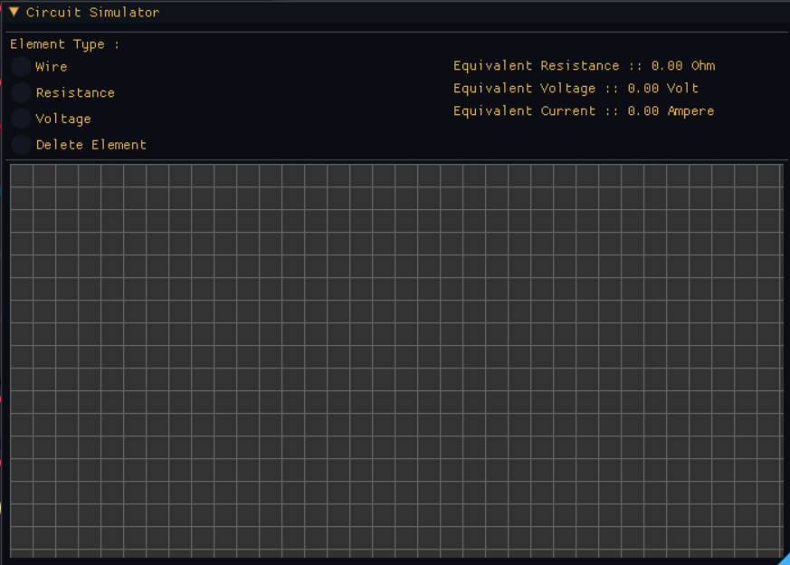
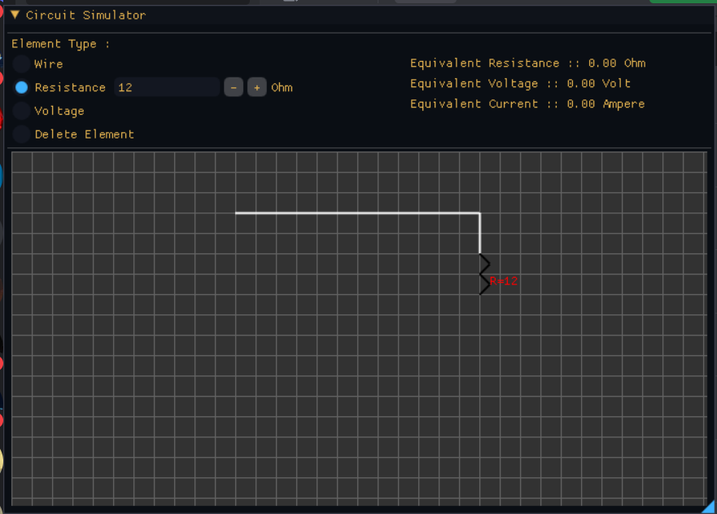
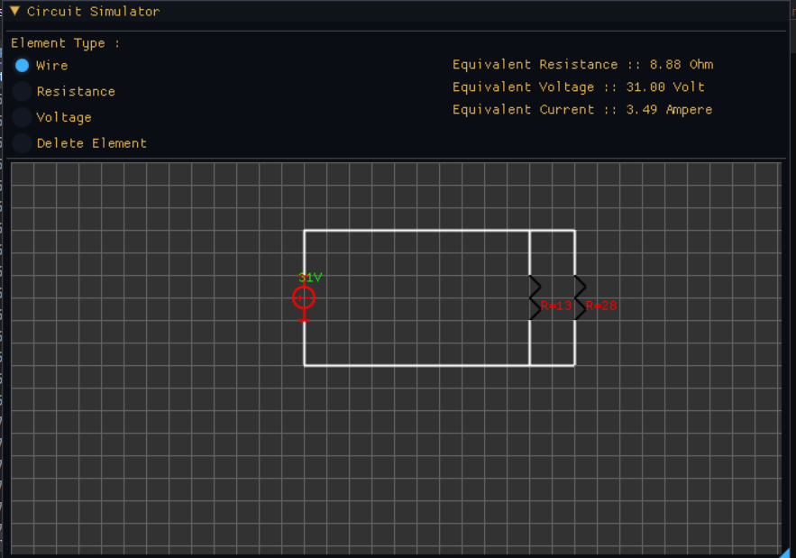
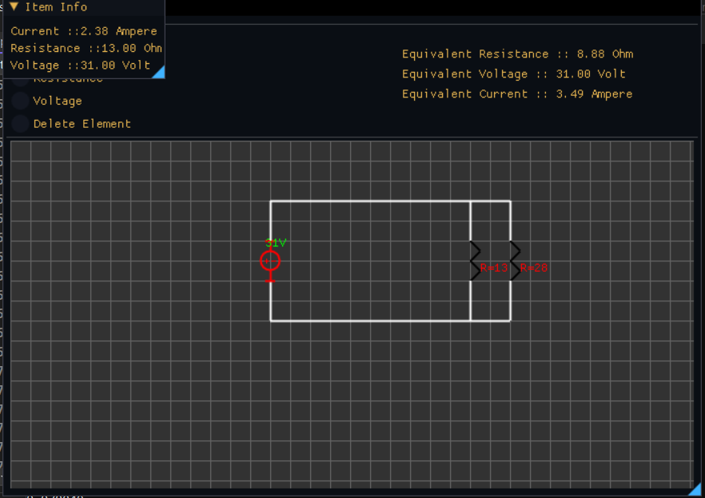

<p align="center">
  <a href="" rel="noopener">
    


</p>
<p align="center">
    <br> 
</p>
<div align="center">

[](https://github.com/hamdy-cufe-eng/Circuit-Simulator/contributors)
[](https://github.com/hamdy-cufe-eng/Circuit-Simulator/issues)
[](https://github.com/hamdy-cufe-eng/Circuit-Simulator/network)
[](https://github.com/hamdy-cufe-eng/Circuit-Simulator/stargazers)
[](https://github.com/hamdy-cufe-eng/Circuit-Simulator/blob/main/LICENSE)

</div>

<details>
  <summary>Table of Contents</summary>
  <ol>
    <li>
      <a href="#about">About The Project</a>
      <ul>
        <li><a href="#tech">Built Using</a></li>
      </ul>
    </li>
    <li>
      <a href="#install">Getting Started</a>
      <ul>
        <li><a href="#install">Installation</a></li>
      </ul>
    </li>
    <li><a href="#start">How to start</a></li>
    <li><a href="#features">Features</a></li>
    <li><a href="#screenshots">Screenshots</a></li>
	<li><a href="#contributors">Contributors</a></li>
  </ol>
</details>


## About

 Advanced Circuit Simulator with multiple features, 
 Simplified interface for viewing/displaying data .

## 💻 Built Using <a name = "tech"></a>
* 
- [ImGui]()


## 🏁 Get Started /Installation <a name = "install"></a>
1. **Clone the repository**
```
git clone https://github.com/hamdy-cufe-eng/Circuit-Simulator.git
```
2. **Install Visual Studio **

3. **Open Project**

4. **Build the project**

5. **You can run through**


## 📌 How to use <a name = "start"></a>

### Usage :
- After compiling the project , try to draw a circuit (parallel/series) resistors are allowed
- After finishing the circuit (making sure its already closed one) u can view the current / volt of each element by hovering on it
- You can adjust the values of elements after ticking its checkbox 
- make sure that element are appended by only even number of grid boxes also voltage should be of 2 grid boxes only

## 🎆 Features <a name = "features"></a>

- Drawing a full circuit and solving it
- Adjustable voltage/resistance values
- Ability to solve both parallel and series resistances 
- Viewing item data by hovering on it
- Checking if there is short circuit or open one (won't calculate values untill its a closed one)
- Deleting Elements and a recalculation
- Hovering line to correctly display where the line will be when release the mouse 
- Getting current / voltage in each node (aka voltage/current divider ) by hovering on the element within this node
- Modern Flat-UI using imgui

## 📷 Screenshots <a name = "screenshots" ></a>

<div name="Screenshots" align="center">
   
   <hr>
    
    <hr>
  
   
   <hr>
  
   
   <hr>
</div>

## Contributors <a name = "contributors"></a>
<table align="center">
  <tr>
    <td align="center">
    <a href="https://github.com/hamdy-cufe-eng" target="_black">
    
    <br />
    <sub><b>Hamdy Ahmed</b></sub></a>
    </td>
    <td align="center">
    <a href="https://github.com/maryam-refaatt" target="_black">
    
    <br />
    <sub><b>Maryam Refaat</b></sub></a>
    </td>
     <td align="center">
    <a href="https://github.com/nancyashraff" target="_black">
    
    <br />
    <sub><b>Nancy Ashraf</b></sub></a>
    </td>
    
  </tr>
 </table>
